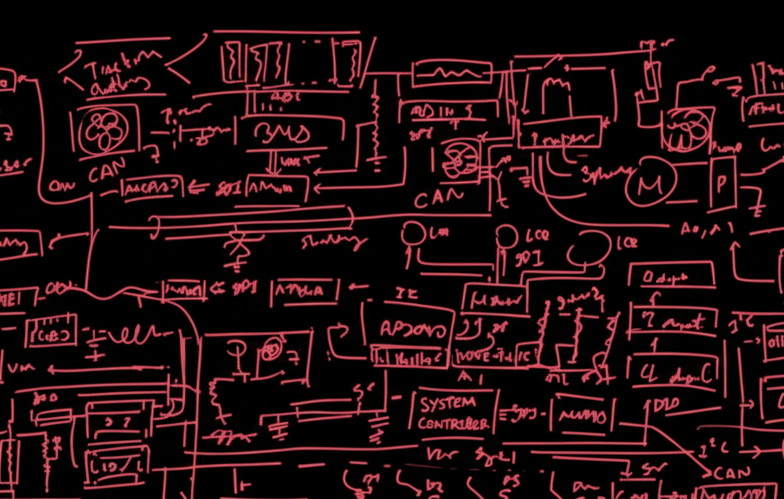
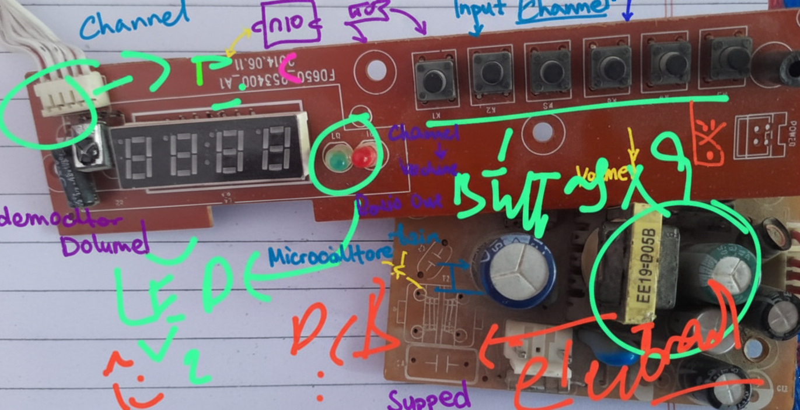

# TV Receiver Simulator

## Overview

The **TV Receiver ** is a fully modular C++17 project designed to simulate the workflow of a digital satellite TV receiver entirely in software. It provides a **console-based simulation** of signal sampling, demodulation, error correction, transport stream decoding, and video/audio reconstruction, complete with ASCII-based visualization. No external hardware is required.

This project is intended for educational purposes, helping developers understand the signal processing, modulation techniques, and multimedia reconstruction behind digital TV receivers.

---

## Super Technical Review

This project implements a **complete TV receiver signal pipeline**, simulating: LNB downconversion, QPSK/BPSK demodulation, noise modeling, Reed-Solomon FEC, transport stream decoding, video frame reconstruction, and audio PCM generation. The code leverages **C++17 features**, including templates, `std::vector`, and `<random>` for noise simulation. The design is **modular**, allowing independent testing of LNB, demodulator, FEC, and decoder modules. ASCII-based visualization allows real-time monitoring of signal waveform, bit error rate (BER), and frame reconstruction accuracy. Mathematical formulas and DSP techniques are annotated throughout the code for educational clarity.

---

## Demodulation Example Code

```cpp
RealSignal generate_real_noisy_signal(double duration, double noise_std_dev) {
    int num_samples = static_cast<int>(f_sampling * duration);
    RealSignal sampled_signal;
    sampled_signal.reserve(num_samples);

    std::normal_distribution<> d(0.0, noise_std_dev);
    double T_s = 1.0 / f_sampling;
    double angular_freq = 2.0 * PI * f_signal;

    for (int n = 0; n < num_samples; ++n) {
        double t = n * T_s;
        // Simulated BPSK/QPSK signal as a noisy cosine wave.
        double signal = 1.0 * std::cos(angular_freq * t + 0.5);
        double noise = d(gen);
        sampled_signal.push_back(signal + noise);
    }
    return sampled_signal;
}
```

---

## Features

1. **LNB Signal Simulation**

   - Generates a downconverted RF signal with configurable frequency and sampling rate.

   ```Cpp
     RealSignal generateRF(const RFParams &p) {
    const int N = static_cast<int>(p.fs * p.dur);
    RealSignal signal; signal.reserve(N);

    const double dt = 1.0 / p.fs;
    const double omega = 2.0 * PI * p.freq;

    for(int n = 0; n < N; ++n) {
        double t = n * dt;
        signal.push_back(std::sin(omega * t));
    }
    return signal;
}

// Hardcore Gaussian noise adder
void addNoise(RealSignal &signal, double stdDev) {
    std::mt19937 rng{std::random_device{}()};
    std::normal_distribution<double> dist(0.0, stdDev);

    for(auto &s : signal) s += dist(rng);
}

   ```

```
     
   - Adds Gaussian noise to simulate real-world channel conditions.
   - Supports easy adjustments to signal parameters.

2. **Modulation and Demodulation**

   - Supports QPSK and 8PSK demodulation algorithms.
   - Includes symbol synchronization and carrier recovery.
   - Math formulas for modulation/demodulation are included in code comments.

3. **Forward Error Correction (FEC)**

   - Implements Reed-Solomon and convolutional coding.
   - Corrects errors introduced by simulated channel noise.
   - Includes detailed math explanations in comments.

4. **Transport Stream (MPEG-TS) Decoding**

   - Parses transport stream packets.
   - Extracts video and audio streams for further processing.

5. **Video Reconstruction**

   - Decodes raw video frames into a pixel buffer.
   - Displays frames in console using ASCII characters or grayscale blocks.
   - Supports optional run-length compression for efficient storage.

6. **Audio Reconstruction**

   - Decodes audio frames into PCM samples.
   - Provides a simple simulation of audio output via console.

7. **Visualization and Debugging**

   - ASCII graph of signal waveform.
   - Displays signal amplitude, bit error rate, frame number, and other diagnostics.
   - Provides insight into the internal workings of a digital TV receiver.

8. **Modular Architecture**

   - Clean separation of components: LNB, Demodulator, FEC, Decoder, Video, Audio.
   - Easily extendable for future features.

9. **Simulation Control**

   - Runtime configuration of channel frequency, noise level, and modulation type.
   - Continuous loop simulates real-time TV reception.

---

## Project Structure

```
TV_Receiver_Simulator/
├── src/
│   ├── main.cpp          # Entry point
│   ├── LNB.h/.cpp        # Signal sampling simulation
│   ├── Demodulator.h/.cpp# Demodulation algorithms
│   ├── FEC.h/.cpp        # Forward error correction
│   ├── Decoder.h/.cpp    # Transport stream parsing
│   ├── Video.h/.cpp      # Video reconstruction and ASCII display
│   └── Audio.h/.cpp      # Audio reconstruction and simulation
├── include/
│   └── common.h          # Shared constants, math functions
├── CMakeLists.txt        # Build configuration
└── README.md             # Project documentation
```

---

## Images




---

---

## License

MIT License – free to use, modify, and distribute.
